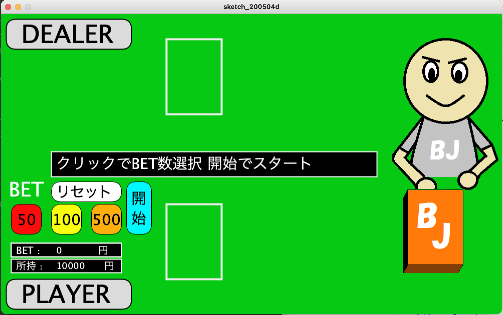
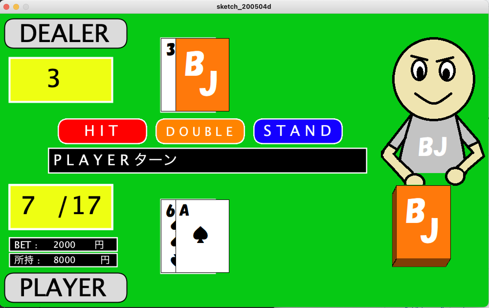
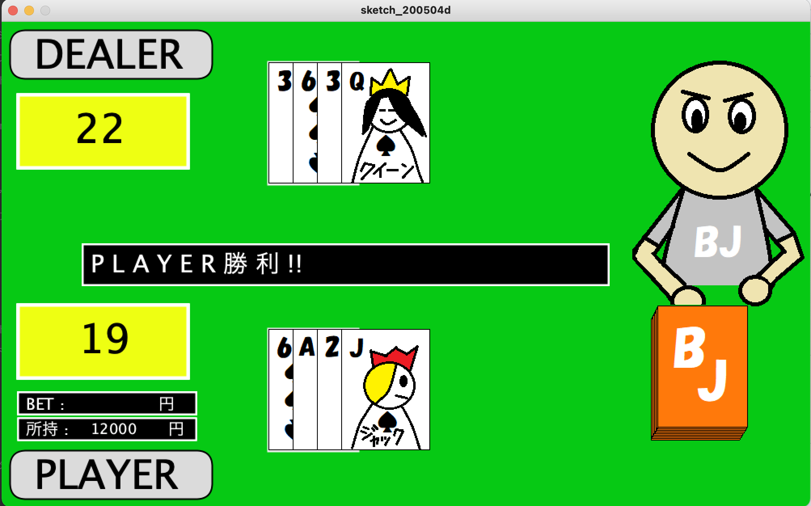
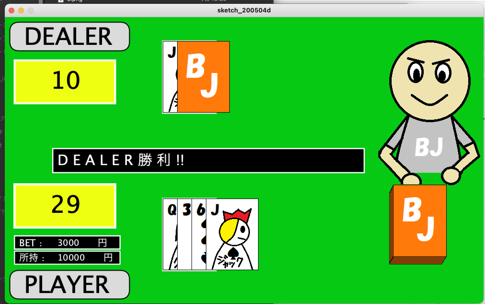

## ブラックジャックゲーム  
大学時代のゼミ課題として約1か月かけて制作したブラックジャックゲームです。  
当時スマートフォンでブラックジャックを遊んでいたことから、「実際に遊べるゲームを自分で実装してみたい」と考え、制作しました。  
  
### ・ソースコード  
メインプログラムは以下にあります。  
  
BJ/sketch_200504d/sketch_200504d.pde  
  

  
・開発環境：Processing  
・開発期間：約1か月  
  
  
### ・実装した主な機能  
　・ブラックジャックの基本ルールを実装  
　　　・ディーラーは合計17以上になるまでカードを引く  
　　　・合計22以上でバースト（敗北）  
　　　・ブラックジャック（Aと10点札）の判定  
　　　・ディーラーとプレイヤーの得点を比較した勝敗判定  
　・プレイヤーの操作  
　　　・HIT  
　　　・STAND  
　　　・DOUBLE  
　・BET（賭け金）システム  
　・所持金の管理  
　・所持金がBET金額未満の場合はDOUBLEを選択不可  
　・所持金が0になるとGAME OVER  
  
  
### ・制作でこだわった点  
GUIを用いて、視覚的に楽しめるゲーム画面を目指しました。  
ディーラーのキャラクターやトランプの絵札を自作し、オリジナリティのあるデザインにしました。  
カードを瞬時に表示するのではなく、実際にカードをめくるようなアニメーションを追加し、ゲームらしい緊張感を演出しました。  
所持金やBET金額に応じて選択できる操作を制限するなど、実際のゲーム性を意識した細かな仕様も実装しました。  
  
  
### ・制作を通して学んだこと  
ゲームの状態管理（BET、プレイ、勝敗判定、GAME OVERなど）の考え方  
条件分岐を用いたゲームルールの実装  
GUIを用いたユーザーインターフェースの設計  
プレイヤーが楽しめるよう、ゲーム性だけでなく演出面も考慮して実装することの重要性  
  
  
### ・備考  
現在の技術水準から見ると改善できる点はありますが、学生時代の学習成果を残す目的で、制作当時の状態のまま公開しています。  

## スクリーンショット

### タイトル画面

### プレイ画面

### プレイヤー勝利画面

### プレイヤーバースト画面

